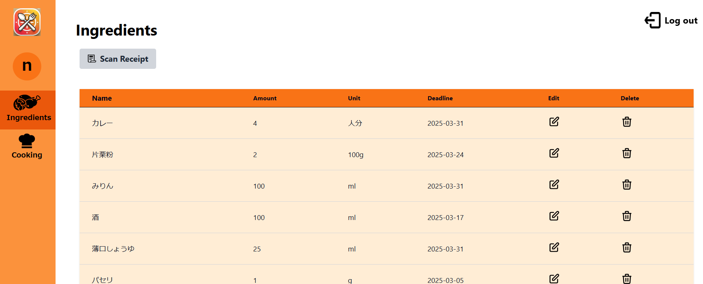
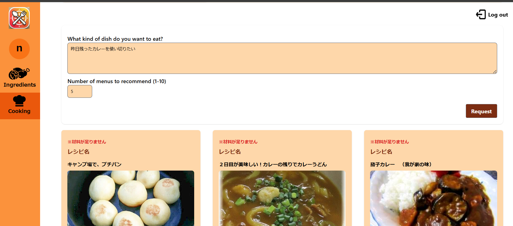
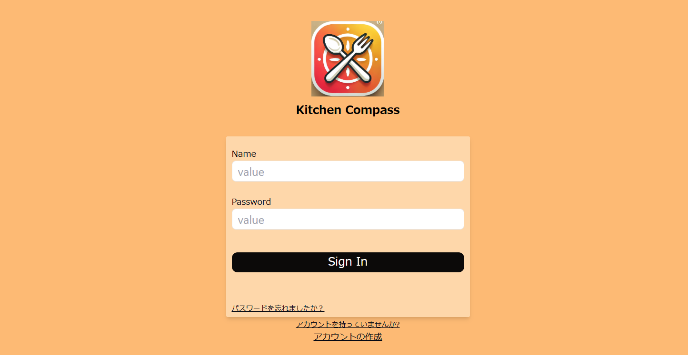

# Kitchen Compass
## 概要
食材管理＆レシピレコメンドアプリです。
ユーザーごとに食材を管理し、ユーザーのリクエストに合わせてレシピをレコメンドしてくれます。  
Sentence-BERTを使用し、レシピ内容とリクエストをベクトル化しておすすめのレシピをレコメンドします。

## 食材管理機能
食材の量、期限を管理します。  
レシートから食材をスキャンできます。


## メニューレコメンド機能
ユーザーのリクエストに合わせたレシピを推薦してくれます。モードを「家にある＆期限内」「家にある」「家にないものでもOK」から選び、それに合わせて足りない食材も教えてくれます。  
楽天レシピのページにも遷移できます。
  

# アプリのデプロイ方法  
## 前提
- kitchen_compass_batchを実行し、recipe.dbを作成していること
- kitchen_comapss_terraformでterraform applyを実行し、環境のデプロイが完了していること  

## 手順
- ローカル環境上で当リポジトリをクローンします
### frontend
- frontend内「.env」ファイルに以下のように記載します。  
    ```sh
    # バックエンドAPIのパス
    REACT_APP_API_PATH=/api/v1
    ```

### backend
- backend内「.env」ファイルに以下のように記載します。  
    ```sh
    # ポート番号(変更の必要なし)
    PORT=3500
    # AWSリージョン
    AWS_REGION=ap-northeast-1
    # CognitoのクライアントID
    COGNITO_CLIENT_ID=
    # Cognitoのクライアントシークレット
    COGNITO_CLIENT_SECRET=
    # CognitoのユーザープールID
    COGNITO_USER_POOL_ID=
    # APIバージョン(現在はv1のみ)
    API_VERSION=v1
    # DBのパス(efsにマウント)
    DB_PATH=/mnt/efs/db/app.db
    # レシピDBのパス(基本変更しない)
    RECIPE_DB_PATH=db/recipe/recipes.db
    # GCPサービスアカウントキーJSONファイルのパス
    GOOGLE_APPLICATION_CREDENTIALS=
    # Gemini APIのキー
    GEMINI_API_KEY=
    # レシピ推薦APIのURL(変更の必要なし)
    RECOMMENDATION_API_URL=http://localhost:5000
    ```
    GCPサービスアカウントキーの取得、GeminiAPIのキーが必要になります。
- backend/db/recipe内に、batchで作成したrecipes.dbを格納します
- configフォルダ内にGPCサービスアカウントキーのJsonファイルを格納します

### S3への格納  
S3にアプリを格納し、CodePipeline,CodeDeploy経由でEC2にデプロイを行います。  
上記手順後、リポジトリ全体をzipで圧縮します  
```sh
zip -r kitchen_compass.zip kitchen_compass
```
- アーティファクト用S3バケットにアップロードします
```sh
aws s3 cp kitchen_compass.zip s3://kitcom-prd-artifact-bucket
```
- 数分後、URLにアクセスしサインイン画面が表示されることを確認します


### 各種ドキュメント
NotionとFigmaのリンクです
[機能要件](https://tall-volcano-d6a.notion.site/1884fcf8811a8057ba6cdc13dac3b3f9)  
[非機能要件](https://tall-volcano-d6a.notion.site/1894fcf8811a80be8a9dc0f87a6818d7?pvs=73)  
[設計資料](https://tall-volcano-d6a.notion.site/1914fcf8811a802bbe1ac54c523caad9?pvs=73)  
[技術選定](https://tall-volcano-d6a.notion.site/1944fcf8811a808cb7d1e6d835df9429?pvs=73)  